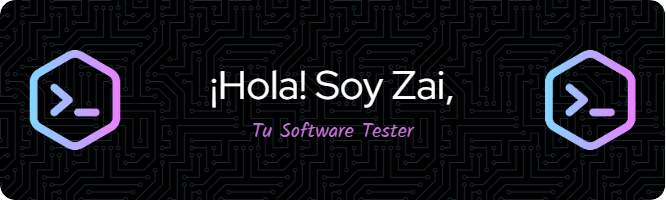

# 💻 QA Tester | Manual y Automatizado

¡Hola! Soy un apasionado **QA Tester** con experiencia en **pruebas manuales y automatizadas**. Mi objetivo es garantizar la calidad del software mediante el diseño, ejecución y automatización de pruebas que mejoren la funcionalidad, el rendimiento y la experiencia del usuario.

## 🚀 Habilidades

Estas son algunas de las herramientas y tecnologías que utilizo en mi trabajo:

### Pruebas y Automatización

### Gestión de proyectos y documentación

### Programación y bases de datos

## 📌 Sobre mí
- 🔍 **Enfocado en garantizar la calidad del software** mediante pruebas rigurosas y estrategias de automatización.
- 🛠 **Experiencia en pruebas de API**, automatización de UI y validación de bases de datos.
- 📚 Siempre aprendiendo y **explorando nuevas metodologías de prueba con la IA**.

💬 ¡Conectemos! Siempre estoy abierto a colaborar en proyectos interesantes y contribuir a la garantía de calidad en el desarrollo.

<!--
**valenzzaira/valenzzaira** is a ✨ _special_ ✨ repository because its `README.md` (this file) appears on your GitHub profile.

Here are some ideas to get you started:

- 🔭 I’m currently working on ...
- 🌱 I’m currently learning ...
- 👯 I’m looking to collaborate on ...
- 🤔 I’m looking for help with ...
- 💬 Ask me about ...
- 📫 How to reach me: ...
- 😄 Pronouns: ...
- ⚡ Fun fact: ...
-->
